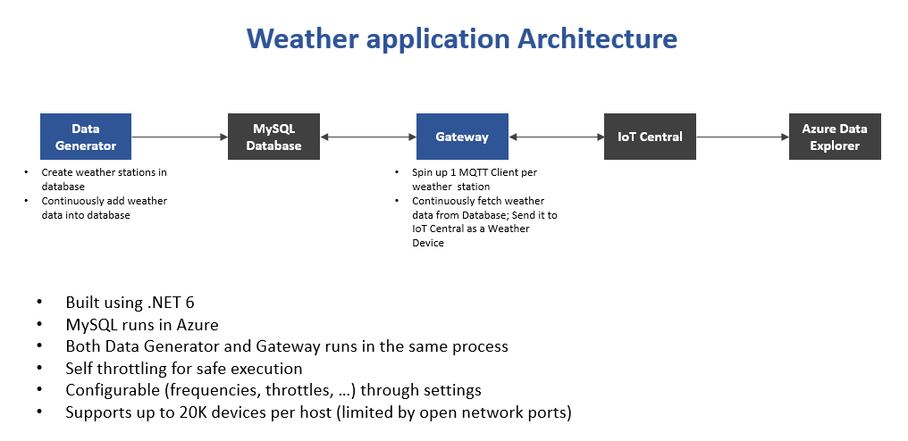

# IoT Weather
This application acts as a gateway that gets the weather data from MySQL DB and send it into IoT Central through devices (one per weather station).


## Architecture ##



## Development Environment Setup ##
1. Install [.NET 6](https://dotnet.microsoft.com/en-us/download/dotnet/6.0)
2. Install [VS Code](https://code.visualstudio.com/Download)
3. Install [ C# VS Code extension](https://marketplace.visualstudio.com/items?itemName=ms-dotnettools.csharp)
4. Create My SQL Database (preferably in Azure), get the connection string.
5. Install a MySQL database client such as [DBeaver](https://dbeaver.io/download/) or [MySQL Workbench](https://dev.mysql.com/downloads/workbench/)
6. Create the database using the [setup/database.sql](setup/database.sql) script.
7. Create an IoT Central application. Import [Weather Station](setup/WeatherStation.json) device template into the application.
8. Setup a new ADX Cluster with a database. Use the [setup/WeatherStation.kql](setup/WeatherStation.kql) file to create a table.
9. Setup Continuous Data Export (CDE) to the above database and table. Use the (setup/transform.jq)[setup/transform.jq] to transform and insert telemetry data into the table.


## Build and run Application ##
1. To build the application, run `dotnet build` from the root folder.
2. Copy [setup/DigiCertGlobalRootCA.crt.pem](setup/DigiCertGlobalRootCA.crt.pem) file to bin/debug/net6.0 folder. This is needed to connect to MySQL Database running in Azure.
3. Export `Environment` environment variable to type of environment you are running the app (development. test, prod). E.g. `SET Environment=development` on windows or `export Environment=development` on Linux. You can override default settings in `appsettings.json` in the `appsettings.{Envuronment}.json` file.
4. In `bin/debug/net6.0` folder, add `appsettings.development.json` file with the override parameters. Do not check this file into source as it contains secrets. This should be preferably stored in a Keyvault. You can adjust rest of the default parameters such as `RefreshInterval` by overriding them in this file.
E.g.
```JSON
{
    "Settings": {
        "Database": {
            "ConnectionString": "Server=YOUR_DB_SERVER.mysql.database.azure.com;UserID=YOUR_USER_NAME;Password=YOUR_PASSWORD;Database=weather;SslMode=Required;SslCa=DigiCertGlobalRootCA.crt.pem"
        },
        "IoTCentral": {
            "IDScope": "YOUR APP IDSCOPE",
            "GroupSASKey": "YOUR APP GROUP SAS KEY"
        }
    }
}
```
5. To run the application, run the `weatherdb.exe` from `bin/debug/net6.0` folder.
6. Log files will be generated in `logs` folder. Log file will be rotated once a day.

### Settings format
This application is configurable through `appsettings.json` file. The following is the format of the file.
```JSON
{
    "Settings": {
        "Database": {
            "ConnectionString": ""
        },
        "IoTCentral": {
            "GlobalDeviceEndpoint ": "global.azure-devices-provisioning.net",
            "IDScope": "",
            "GroupSASKey": "",
            "ModelId": "dtmi:demobc:WeatherStation;1"
        },
        "DataGenerator": {
            "Enabled": true,
            "GenerationInterval": 60,
            "StationCount": 300
        },
        "Gateway": {
            "Enabled": true,
            "ConcurrentConnectionLimit": 50,
            "ConcurrentMessageLimit": 50,
            "RefreshInterval": 60
        }
    }
}
```
Parameter                 | Description
--------------------------|------------------------------
**Database**
ConnectionString          | MySQL Database connection string. You can get it from the Development environment setup step #4
**IoTCentral**
GlobalDeviceEndpoint      | DPS Registration global endpoint. For public cloud it is `global.azure-devices-provisioning.net`
IDScope                   | IoT Central application DPS IDScope. You can get it from IoT Central -> Administration -> Device connection -> ID Scope
GroupSASKey               | IoT Central application group SAS key. You can get it from IoT Central -> Administration -> Device connection -> Enrollment groups -> SAS-IoT-Devices -> Primary Key
ModelID                   | The identity of the device template. If you used the [Weatherstation](setup/WeatherStation.json), it is `dtmi:demobc:WeatherStation;1`
**DataGenerator**
Enabled                   | If this is set to true, data will be generated and inserted into database. If this is set to false, no data is inserted
GenerationInterval        | How often (in seconds) should the data generator generate data?
StationCount              | Number of weather stations to generate data for
**Gateway**
Enabled                   | If this is set to true, gateway will read data from database and send it to IoT Central. If this is set to false, no data is setnt to IoT Central
ConcurrentConnectionLimit | Number of concurrent connections to be opened to IoT Central
ConcurrentMessageLimit    | Number of concurrent telemetry messages to be sent to IoT Central
RefreshInterval           | How often (in seconds) should the gateway scan for telemetry in the database to be sent data to IoT Central?
